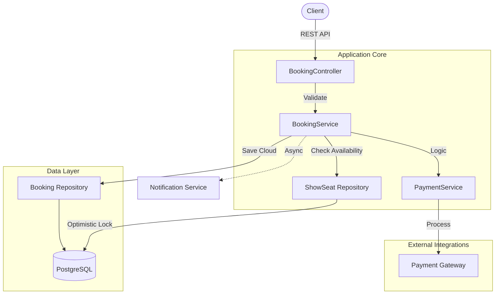

# Cinema Booking Service


A scalable, thread-safe cinema ticket booking system engineered to handle high concurrency with **JPA Optimistic Locking** and **Distributed Transactions**.

## Table of Contents
- [Architecture](#architecture)
- [Key Features](#key-features)
- [Getting Started](#getting-started)
- [Documentation](#documentation)
- [API Reference](#api-reference)

---

## Architecture

### System Design
The system handles concurrent booking requests where multiple users compete for the same seats. It uses **Optimistic Locking** (`@Version`) to ensure data integrity without performance-heavy database locks.



### Locking Mechanism (Handling Race Conditions)
1. **User A** and **User B** select the same seat (Version 1).
2. **User A** submits booking -> DB checks Version 1 -> Matches -> Updates to Version 2 -> **Success**.
3. **User B** submits booking -> DB checks Version 1 -> **Mismatch** (Current is 2) -> **Fail**.
4. System throws `ObjectOptimisticLockingFailureException` -> Returns `409 Conflict` to User B.

---

## Key Features

### Concurrency and Integrity
- **Optimistic Locking**: Prevents double-bookings efficiently.
- **Seat Holding**: Temporary reservation (10 minutes) before payment.
- **Ghost Booking Protection**: Automated refund mechanism if payment succeeds but booking fails (rare race condition).

### Financial
- **Payment Strategy Pattern**: Pluggable architecture for payment providers (Stripe, PayPal).
- **Transaction Boundaries**: Payment processing is decoupled from DB transactions to prevent connection holding.

### Integration
- **TMDb Integration**: Admin dashboard to import movies directly from *The Movie Database*.
- **Adapter Pattern**: Flexible design to swap data providers.

### Security
- **JWT Authentication**: Stateless, secure access.
- **Role-Based Access Control (RBAC)**: Admin vs User permissions.
- **Rate Limiting**: Resilience4j integration to prevent abuse.

---

## Getting Started

### Prerequisites
- Java 21 LTS
- Docker and Docker Compose
- Maven (Wrapper included)

### Quick Start (Recommended)

One command to start Database and Application:
```bash
./scripts/start.sh
```

### Manual Setup

1. **Start Database**
   ```bash
   docker-compose up -d
   ```

2. **Run Application**
   ```bash
   ./mvnw spring-boot:run
   ```

Access the API at `http://localhost:8080/api`

---

## Documentation

Detailed documentation has been organized into the `docs/` folder:

- [**Startup Guide**](docs/STARTUP_GUIDE.md) - Detailed setup instructions.
- [**Deployment**](docs/DEPLOYMENT.md) - Production deployment guide.
- [**TMDb Integration**](docs/TMDB_INTEGRATION_GUIDE.md) - How to use the Movie Import feature.

---

## API Reference

### Public
| Method | Endpoint | Description |
|--------|----------|-------------|
| GET | `/api/movies` | List all movies |
| GET | `/api/shows` | List shows for a movie |
| POST | `/api/auth/login` | Authenticate user |

### Protected (Bearer Token)
| Method | Endpoint | Description |
|--------|----------|-------------|
| POST | `/api/bookings/confirm-with-payment` | **Production:** Hold + Pay + Book |
| POST | `/api/bookings/hold` | Hold seats temporarily |
| GET | `/api/bookings/my-bookings` | View user history |

View full API documentation on Swagger UI: `http://localhost:8080/swagger-ui.html`

---

## Testing

The project maintains **100% Pass Rate** across 9 Unit and Integration test suites.

Run tests:
```bash
./mvnw test
```

Run coverage report:
```bash
./mvnw clean test jacoco:report
```

---

*Built for high-performance and reliability.*
